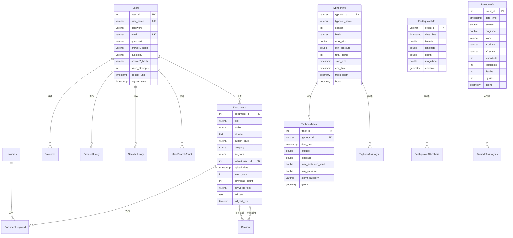

# 气象科学研究数据平台 —— 数据库设计文档 v6.0

**数据库管理系统**：PostgreSQL 15+（含 PostGIS 3.x 空间扩展）
**数据库名称**：`AcademicSearchDB`
**字符集**：`UTF8`
**设计原则**：遵循第三范式（3NF），外键维护引用完整性，空间列使用 PostGIS geometry 类型


## 1. 实体关系图（E-R 图）




## 2. 表结构详细说明

### 2.1 用户表（`users`）

**业务作用**：存储注册用户信息、登录凭证（Werkzeug scrypt 哈希密码）、安全问答及账户安全状态。

| 字段名 | 数据类型 | 约束 | 默认值 | 描述 |
| :--- | :--- | :--- | :--- | :--- |
| `user_id` | `SERIAL` | **PRIMARY KEY** | - | 用户唯一标识（自增） |
| `user_name` | `VARCHAR(50)` | **NOT NULL**, **UNIQUE** | - | 登录用户名 |
| `password` | `VARCHAR(255)` | **NOT NULL** | - | Werkzeug `generate_password_hash` 加密密码 |
| `email` | `VARCHAR(100)` | **NOT NULL**, **UNIQUE** | - | 绑定邮箱 |
| `question1` | `VARCHAR(200)` | - | `NULL` | 安全问题1 |
| `answer1_hash` | `VARCHAR(255)` | - | `NULL` | 问题1答案哈希（不可逆） |
| `question2` | `VARCHAR(200)` | - | `NULL` | 安全问题2 |
| `answer2_hash` | `VARCHAR(255)` | - | `NULL` | 问题2答案哈希（不可逆） |
| `failed_attempts` | `INT` | **NOT NULL** | `0` | 连续失败次数 |
| `lockout_until` | `TIMESTAMP` | - | `NULL` | 锁定到期时间（NULL=未锁定） |
| `register_time` | `TIMESTAMP` | **NOT NULL** | `NOW()` | 注册时间戳 |

### 2.2 文献表（`documents`）

**业务作用**：存储学术文献元数据、PDF 路径及全文，通过 `full_text_tsv` 列实现 PostgreSQL 全文检索。

| 字段名 | 数据类型 | 约束 | 默认值 | 描述 |
| :--- | :--- | :--- | :--- | :--- |
| `document_id` | `SERIAL` | **PRIMARY KEY** | - | 文献唯一标识 |
| `title` | `VARCHAR(500)` | **NOT NULL** | - | 文献标题 |
| `author` | `VARCHAR(200)` | **NOT NULL** | - | 作者 |
| `abstract` | `TEXT` | - | `NULL` | 摘要 |
| `publish_date` | `VARCHAR(50)` | - | `NULL` | 发表日期 |
| `category` | `VARCHAR(100)` | - | `NULL` | 学科分类 |
| `file_path` | `VARCHAR(500)` | - | `NULL` | PDF 在服务器上的相对路径 |
| `upload_user_id` | `INT` | **NOT NULL**, **FK** | - | 上传者用户ID |
| `keywords_text` | `VARCHAR(1000)` | - | `NULL` | 关键词文本（分号分隔，展示用） |
| `full_text` | `TEXT` | - | `NULL` | PDF 提取的全文内容 |
| `full_text_tsv` | `tsvector` | - | 触发器生成 | 全文检索向量（GIN 索引，权重: A-标题/B-摘要/C-全文） |
| `view_count` | `INT` | **NOT NULL** | `0` | 浏览次数 |
| `download_count` | `INT` | **NOT NULL** | `0` | 下载次数 |
| `upload_time` | `TIMESTAMP` | **NOT NULL** | `NOW()` | 上传时间戳 |

**全文检索用法**：
```sql
-- 替代 MySQL 的 MATCH ... AGAINST
-- 主搜索：利用 GIN 索引的 tsvector 全文检索（英文高效）
SELECT * FROM documents
WHERE full_text_tsv @@ plainto_tsquery('simple', 'deep learning')
ORDER BY ts_rank_cd(full_text_tsv, plainto_tsquery('simple', 'deep learning')) DESC;

-- 混合策略（兼顾中文）：tsvector 主搜索 + ILIKE 兜底
SELECT * FROM documents
WHERE (
  full_text_tsv @@ plainto_tsquery('simple', '深度学习')
  OR full_text ILIKE '%深度学习%'
)
ORDER BY ts_rank_cd(full_text_tsv, plainto_tsquery('simple', '深度学习')) DESC;
```

**检索实现策略**：
- 标题/作者/分类：继续使用 `ILIKE '%xxx%'`，数据量小可接受
- 全文检索（`fulltext` search_type）：使用 `full_text_tsv @@ plainto_tsquery('simple', :kw)` + `full_text ILIKE '%kw%'` 中文兜底
- 全文检索排序：`ORDER BY ts_rank_cd(full_text_tsv, ...) DESC, document_id DESC`
- `fulltext_filter` 高级筛选：同样使用 tsvector + ILIKE 混合策略
- `keyword_filter` 关键词筛选：通过 `document_keyword + keywords` 表 JOIN 实现精确标签匹配
- 数据库使用 `simple` 分词配置（非 `english`），避免词干提取对中文的不良影响

### 2.3 关键词表（`keywords`）

| 字段名 | 数据类型 | 约束 | 默认值 | 描述 |
| :--- | :--- | :--- | :--- | :--- |
| `keyword_id` | `SERIAL` | **PRIMARY KEY** | - | 关键词唯一标识（自增） |
| `keyword_name` | `VARCHAR(200)` | **NOT NULL**, **UNIQUE** | - | 关键词名称（去重存储） |

### 2.4 文献-关键词关联表（`document_keyword`）

| 字段名 | 数据类型 | 约束 | 默认值 | 描述 |
| :--- | :--- | :--- | :--- | :--- |
| `document_id` | `INT` | **PK**, **FK** → `documents` ON DELETE CASCADE | - | 文献ID |
| `keyword_id` | `INT` | **PK**, **FK** → `keywords` ON DELETE CASCADE | - | 关键词ID |
| `tf_idf` | `DOUBLE PRECISION` | **NOT NULL** | `1.0` | TF-IDF 权重（预留） |

### 2.5 引用关系表（`citation`）

| 字段名 | 数据类型 | 约束 | 默认值 | 描述 |
| :--- | :--- | :--- | :--- | :--- |
| `source_document_id` | `INT` | **PK**, **FK** → `documents` ON DELETE CASCADE | - | 引用来源文献 |
| `target_document_id` | `INT` | **PK**, **FK** → `documents` ON DELETE CASCADE | - | 被引目标文献 |

额外约束：`CHECK (source_document_id <> target_document_id)` 防止自引用。

### 2.6 收藏表（`favorites`）

| 字段名 | 数据类型 | 约束 | 默认值 | 描述 |
| :--- | :--- | :--- | :--- | :--- |
| `favorite_id` | `SERIAL` | **PRIMARY KEY** | - | 收藏记录唯一标识 |
| `user_id` | `INT` | **NOT NULL**, **FK** → `users` ON DELETE CASCADE | - | 用户ID |
| `document_id` | `INT` | **NOT NULL**, **FK** → `documents` ON DELETE CASCADE | - | 文献ID |
| `create_time` | `TIMESTAMP` | **NOT NULL** | `NOW()` | 收藏时间 |

额外约束：`UNIQUE (user_id, document_id)` 防止重复收藏。

### 2.7 检索历史表（`search_history`）

| 字段名 | 数据类型 | 约束 | 默认值 | 描述 |
| :--- | :--- | :--- | :--- | :--- |
| `history_id` | `SERIAL` | **PRIMARY KEY** | - | 检索记录唯一标识 |
| `user_id` | `INT` | **NOT NULL**, **FK** → `users` ON DELETE CASCADE | - | 用户ID |
| `search_keyword` | `VARCHAR(500)` | **NOT NULL** | - | 检索关键词 |
| `search_time` | `TIMESTAMP` | **NOT NULL** | `NOW()` | 检索时间 |

### 2.8 浏览历史表（`browse_history`）

| 字段名 | 数据类型 | 约束 | 默认值 | 描述 |
| :--- | :--- | :--- | :--- | :--- |
| `browse_history_id` | `SERIAL` | **PRIMARY KEY** | - | 浏览记录唯一标识 |
| `user_id` | `INT` | **NOT NULL**, **FK** → `users` ON DELETE CASCADE | - | 用户ID |
| `document_id` | `INT` | **NOT NULL**, **FK** → `documents` ON DELETE CASCADE | - | 文献ID |
| `view_time` | `TIMESTAMP` | **NOT NULL** | `NOW()` | 浏览时间 |

### 2.9 用户搜索统计表（`user_search_count`）

| 字段名 | 数据类型 | 约束 | 默认值 | 描述 |
| :--- | :--- | :--- | :--- | :--- |
| `user_id` | `INT` | **PRIMARY KEY**, **FK** → `users` ON DELETE CASCADE | - | 用户ID |
| `search_count` | `INT` | **NOT NULL** | `0` | 累积检索次数 |

### 2.10 关键词搜索统计表（`keyword_search_count`）

| 字段名 | 数据类型 | 约束 | 默认值 | 描述 |
| :--- | :--- | :--- | :--- | :--- |
| `keyword` | `VARCHAR(200)` | **PRIMARY KEY** | - | 关键词 |
| `search_count` | `INT` | **NOT NULL** | `0` | 累积被搜索次数 |


## 3. 气象灾害模块表结构

### 3.1 台风信息表（`typhoon_info`）

**数据来源**：IBTrACS v04r01 · 范围：太平洋区域（100°E–180°E，0°–60°N）

| 字段名 | 数据类型 | 约束 | 默认值 | 描述 |
| :--- | :--- | :--- | :--- | :--- |
| `typhoon_id` | `VARCHAR(50)` | **PRIMARY KEY** | - | IBTrACS SID |
| `typhoon_name` | `VARCHAR(100)` | **NOT NULL** | - | 台风名称 |
| `season` | `INT` | **NOT NULL** | - | 所属年份 |
| `basin` | `VARCHAR(50)` | - | `'WP'` | 海域代码 |
| `max_wind` | `DOUBLE PRECISION` | - | `0` | 生命周期最大风速（knots） |
| `min_pressure` | `DOUBLE PRECISION` | - | `9999` | 生命周期最低中心气压（hPa） |
| `total_points` | `INT` | - | `0` | 路径点总数 |
| `start_time` | `TIMESTAMP` | - | `NULL` | 首次观测时间（UTC） |
| `end_time` | `TIMESTAMP` | - | `NULL` | 末次观测时间（UTC） |
| `track_geom` | `geometry(LineString, 4326)` | - | `NULL` | ★ PostGIS 轨迹线 |
| `bbox` | `geometry(Polygon, 4326)` | - | `NULL` | ★ 轨迹外包矩形 |

空间索引：`GIST (track_geom)`, `GIST (bbox)`

### 3.2 台风路径点表（`typhoon_track`）

| 字段名 | 数据类型 | 约束 | 默认值 | 描述 |
| :--- | :--- | :--- | :--- | :--- |
| `track_id` | `SERIAL` | **PRIMARY KEY** | - | 路径点标识 |
| `typhoon_id` | `VARCHAR(50)` | **NOT NULL**, **FK** → `typhoon_info` ON DELETE CASCADE | - | 关联台风ID |
| `date_time` | `TIMESTAMP` | **NOT NULL** | - | 观测时间（UTC） |
| `latitude` | `DOUBLE PRECISION` | **NOT NULL** | - | 纬度 |
| `longitude` | `DOUBLE PRECISION` | **NOT NULL** | - | 经度 |
| `max_sustained_wind` | `DOUBLE PRECISION` | - | `0` | 最大持续风速（knots） |
| `min_pressure` | `DOUBLE PRECISION` | - | `9999` | 最低中心气压（hPa） |
| `storm_category` | `VARCHAR(50)` | - | `''` | 强度等级（TD/TS/C1–C5） |
| `geom` | `geometry(Point, 4326)` | **NOT NULL** | - | ★ PostGIS 观测点（触发器自动生成） |
| `wind_radius7_ne/se/sw/nw` | `DOUBLE PRECISION` | - | `0` | 七级风圈各象限半径（海里） |
| `wind_radius10_ne/se/sw/nw` | `DOUBLE PRECISION` | - | `0` | 十级风圈各象限半径（海里） |

空间索引：`GIST (geom)`

### 3.3 台风 AI 分析缓存表（`typhoon_ai_analysis`）

| 字段名 | 数据类型 | 约束 | 默认值 | 描述 |
| :--- | :--- | :--- | :--- | :--- |
| `typhoon_id` | `VARCHAR(50)` | **PK**, **FK** → `typhoon_info` ON DELETE CASCADE | - | 台风ID |
| `analysis_type` | `VARCHAR(20)` | **PK** | - | 分析类型：trend / compare / impact / travel |
| `content` | `TEXT` | **NOT NULL** | - | AI 分析结果文本（DeepSeek） |
| `created_at` | `TIMESTAMP` | - | `NOW()` | 首次生成时间 |

### 3.4 地震信息表（`earthquake_info`）

**数据来源**：USGS Earthquake Catalog（FDSN Event Web Service）
**范围约束**：全球数据（可通过 API 参数过滤中国及周边：经度 73°E–135°E，纬度 18°N–54°N）

| 字段名 | 数据类型 | 约束 | 默认值 | 描述 |
| :--- | :--- | :--- | :--- | :--- |
| `event_id` | `VARCHAR(30)` | **PRIMARY KEY** | - | USGS 事件ID（如 `us7000rr52`） |
| `date_time` | `TIMESTAMP` | **NOT NULL** | - | 发震时间（UTC） |
| `latitude` | `DOUBLE PRECISION` | **NOT NULL** | - | 纬度 |
| `longitude` | `DOUBLE PRECISION` | **NOT NULL** | - | 经度 |
| `depth` | `DOUBLE PRECISION` | - | `0` | 震源深度（km） |
| `magnitude` | `DOUBLE PRECISION` | - | `0` | 震级 |
| `mag_type` | `VARCHAR(10)` | - | `''` | 震级类型 |
| `place` | `VARCHAR(300)` | - | `''` | 参考地点描述 |
| `status` | `VARCHAR(20)` | - | `''` | 审核状态 |
| `tsunami` | `INT` | - | `0` | 海啸预警（0=无，1=有） |
| `alert` | `VARCHAR(20)` | - | `''` | 警报级别 |
| `significance` | `INT` | - | `0` | 事件显著性 |
| `epicenter` | `geometry(Point, 4326)` | **NOT NULL** | - | ★ PostGIS 震中点（触发器自动生成） |

其余字段：`gap`, `dmin`, `rms`, `nst`, `horizontal_error`, `depth_error`, `mag_error`, `mag_nst`, `updated` — 各类定位和质量参数。

空间索引：`GIST (epicenter)`

### 3.5 地震 AI 分析缓存表（`earthquake_ai_analysis`）

| 字段名 | 数据类型 | 约束 | 默认值 | 描述 |
| :--- | :--- | :--- | :--- | :--- |
| `event_id` | `VARCHAR(30)` | **PK**, **FK** → `earthquake_info` ON DELETE CASCADE | - | 地震事件ID |
| `analysis_type` | `VARCHAR(20)` | **PK** | - | 分析类型：trend / risk / impact |
| `content` | `TEXT` | **NOT NULL** | - | AI 分析结果文本（DeepSeek） |
| `created_at` | `TIMESTAMP` | - | `NOW()` | 首次生成时间 |

### 3.6 龙卷风信息表（`tornado_info`）

**数据来源**：NOAA SPC · 全美龙卷风历史数据库 1950–2024

| 字段名 | 数据类型 | 约束 | 默认值 | 描述 |
| :--- | :--- | :--- | :--- | :--- |
| `event_id` | `SERIAL` | **PRIMARY KEY** | - | 自增主键 |
| `date_time` | `TIMESTAMP` | **NOT NULL** | - | 发生时间（UTC+8） |
| `latitude` | `DOUBLE PRECISION` | **NOT NULL** | - | 纬度 |
| `longitude` | `DOUBLE PRECISION` | **NOT NULL** | - | 经度 |
| `place` | `VARCHAR(200)` | - | `''` | 发生地点（县名） |
| `province` | `VARCHAR(50)` | - | `''` | 所在州/省 |
| `ef_scale` | `VARCHAR(10)` | - | `''` | EF 等级（EF0–EF5） |
| `magnitude` | `INT` | - | `0` | EF 等级数值（0–5） |
| `casualties` | `INT` | - | `0` | 伤亡人数 |
| `deaths` | `INT` | - | `0` | 死亡人数 |
| `injuries` | `INT` | - | `0` | 受伤人数 |
| `damage` | `VARCHAR(500)` | - | `''` | 灾害描述 |
| `geom` | `geometry(Point, 4326)` | **NOT NULL** | - | ★ PostGIS 发生地点（触发器自动生成） |
| `confidence` | `VARCHAR(20)` | - | `''` | 可信度 |
| `source` | `VARCHAR(100)` | - | `''` | 数据来源 |

空间索引：`GIST (geom)`

### 3.7 龙卷风 AI 分析缓存表（`tornado_ai_analysis`）

| 字段名 | 数据类型 | 约束 | 默认值 | 描述 |
| :--- | :--- | :--- | :--- | :--- |
| `event_id` | `INT` | **PK**, **FK** → `tornado_info` ON DELETE CASCADE | - | 龙卷风事件ID |
| `analysis_type` | `VARCHAR(20)` | **PK** | - | 分析类型：trend / risk / climate |
| `content` | `TEXT` | **NOT NULL** | - | AI 分析结果文本（DeepSeek） |
| `created_at` | `TIMESTAMP` | - | `NOW()` | 首次生成时间 |


## 4. 约束关系汇总表

| 约束类型 | 涉及表 | 字段 | 具体作用 |
| :--- | :--- | :--- | :--- |
| **主键** | 全部 17 张表 | 各自 ID 或复合字段 | 保证每条记录唯一 |
| **外键** | `documents` | `upload_user_id` → `users.user_id` | 防止孤儿文献 |
| **外键** | `document_keyword` | `document_id` → `documents`；`keyword_id` → `keywords` | 关联真实存在 |
| **外键** | `citation` | `source/target_document_id` → `documents` | 引用双方存在 |
| **外键** | `favorites` | `user_id` → `users`；`document_id` → `documents` | 收藏基于真实数据 |
| **外键** | `browse_history` | `user_id` → `users`；`document_id` → `documents` | 浏览记录真实 |
| **外键** | `search_history` | `user_id` → `users` | 检索记录真实 |
| **外键** | `user_search_count` | `user_id` → `users` | 统计关联真实用户 |
| **外键** | `typhoon_track` | `typhoon_id` → `typhoon_info` | 级联删除 |
| **外键** | `typhoon_ai_analysis` | `typhoon_id` → `typhoon_info` | 级联删除 |
| **外键** | `earthquake_ai_analysis` | `event_id` → `earthquake_info` | 级联删除 |
| **外键** | `tornado_ai_analysis` | `event_id` → `tornado_info` | 级联删除 |
| **唯一键** | `users` | `user_name`, `email` | 防止重复注册 |
| **唯一键** | `keywords` | `keyword_name` | 防止重复关键词 |
| **唯一键** | `favorites` | `(user_id, document_id)` | 防止重复收藏 |
| **唯一键** | `citation` | `(source_document_id, target_document_id)` | 防止重复引用 |
| **唯一键** | `typhoon_ai_analysis` | `(typhoon_id, analysis_type)` | 每种分析仅缓存一份 |
| **唯一键** | `earthquake_ai_analysis` | `(event_id, analysis_type)` | 每种分析仅缓存一份 |
| **唯一键** | `tornado_ai_analysis` | `(event_id, analysis_type)` | 每种分析仅缓存一份 |
| **CHECK** | `citation` | `source_document_id <> target_document_id` | 禁止自引用 |
| **触发器** | `typhoon_track` | `BEFORE INSERT/UPDATE` → `set_geom_from_lonlat()` | 自动生成 geom 列 |
| **触发器** | `earthquake_info` | `BEFORE INSERT/UPDATE` → `earthquake_geom_trigger()` | 自动生成 epicenter 列 |
| **触发器** | `tornado_info` | `BEFORE INSERT/UPDATE` → `set_geom_from_lonlat()` | 自动生成 geom 列 |
| **触发器** | `documents` | `BEFORE INSERT/UPDATE` → `documents_tsv_trigger()` | 自动更新全文检索向量 |


## 5. 数据访问层说明

本项目使用 **FastAPI + SQLAlchemy 2.0 + psycopg2** 作为数据库驱动，通过依赖注入 `get_db()` 获取请求级会话。

### 5.1 连接配置

- **主机**：`localhost`，端口 `5432`
- **用户**：`postgres`（生产环境建议创建独立用户）
- **密码**：优先从环境变量 `DB_PASSWORD` 读取，未设置时使用本地默认值
- **数据库**：`AcademicSearchDB`
- **字符集**：`UTF8`（数据库级别设置）

### 5.2 SQL 语法特征（PostgreSQL）

| 类别 | 写法 |
| :--- | :--- |
| 自增主键 | `SERIAL` / `BIGSERIAL` |
| 参数占位符 | `:param`（SQLAlchemy `text()` 风格）或 `%s`（psycopg2 原始风格） |
| 分页 | `LIMIT n OFFSET m` |
| Upsert | `INSERT ... ON CONFLICT (pk) DO UPDATE SET ...` |
| 当前时间 | `NOW()` |
| 时间运算 | `NOW() - INTERVAL '1 day'` |
| 字符串拼接 | `STRING_AGG(col, ';')`（替代 MySQL `GROUP_CONCAT`） |
| 空值处理 | `COALESCE(col, default)`（替代 MySQL `IFNULL`） |
| 年份提取 | `EXTRACT(YEAR FROM col)` |
| 全文检索 | `column @@ plainto_tsquery('simple', 'keyword')` |
| 空间查询 | `ST_DWithin(geom, ref_geom, distance)` |

### 5.3 索引策略

已建索引涵盖：
- **全文检索**：`GIN (full_text_tsv)` — 为 title/abstract/full_text 提供加权搜索
- **空间索引**：`GIST (geom)` — 为台风路径点、地震震中、龙卷风地点提供快速空间查询
- **常规 B-tree**：category, upload_user_id, title, publish_date, season, magnitude, datetime 等

### 5.4 与 MySQL 5.0 版本的关键差异

| 5.0 (MySQL) | 6.0 (PostgreSQL) |
| :--- | :--- |
| `AUTO_INCREMENT` | `SERIAL` |
| `` `反引号` `` 引用标识符 | 不加引号或 `"双引号"` |
| `MEDIUMTEXT` / `LONGTEXT` | 统一 `TEXT` |
| `FLOAT` | `DOUBLE PRECISION` |
| `DATETIME` | `TIMESTAMP` |
| `FULLTEXT INDEX` + `MATCH...AGAINST` | `GIN` 索引 + `tsvector @@ tsquery` |
| 无空间类型 | PostGIS `geometry(Point/LineString/Polygon, 4326)` |
| `ENGINE=InnoDB, CHARSET=utf8mb4` | 数据库级 UTF8（无需每表指定） |
| 内联 `COMMENT '...'` | `COMMENT ON TABLE/COLUMN ... IS '...'` |
| `ON DUPLICATE KEY UPDATE` | `ON CONFLICT ... DO UPDATE` |
| `YEAR(col)` | `EXTRACT(YEAR FROM col)` |
| `GROUP_CONCAT(col)` | `STRING_AGG(col, ';')` |

---

> **文档说明**：本设计基于 v5.0 MySQL 版本重构为 PostgreSQL + PostGIS，严格匹配 FastAPI 后端各路由的数据操作需求。引入了空间几何类型用于台风/地震/龙卷风模块的空间分析与可视化。
