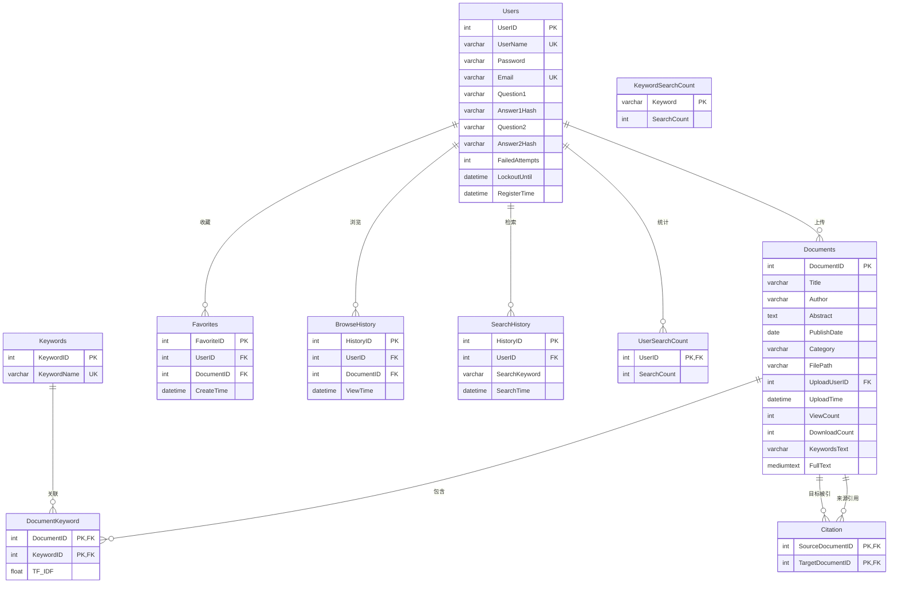

# 气象科学研究数据平台 —— 数据库设计文档

**数据库管理系统**：MySQL（通过 PyMySQL 驱动连接）
**数据库名称**：`AcademicSearchDB`
**字符集**：`utf8mb4`（支持 Unicode，包括 emoji 和中文）
**设计原则**：遵循第三范式（3NF），确保数据冗余最小化，通过外键维护引用完整性。


## 1. 实体关系图（E-R 图）

以下是数据库核心表的实体关系映射（使用 Mermaid 语法），展示了表之间的主键、外键关联。




## 2. 表结构详细说明

### 2.1 用户表（`Users`）
**业务作用**：存储系统注册用户的基本信息、登录凭证（Werkzeug 哈希密码）、密码找回安全问题及账户安全状态（锁定/失败次数）。

| 字段名 | 数据类型 | 约束 | 默认值 | 描述 |
| :--- | :--- | :--- | :--- | :--- |
| `UserID` | `INT` | **PRIMARY KEY**, AUTO_INCREMENT | - | 用户唯一标识（自增） |
| `UserName` | `VARCHAR(20)` | **NOT NULL**, **UNIQUE** | - | 登录用户名（2-20字符） |
| `Password` | `VARCHAR(255)` | **NOT NULL** | - | 经过 Werkzeug `generate_password_hash` 加密的密码 |
| `Email` | `VARCHAR(100)` | **NOT NULL**, **UNIQUE** | - | 绑定邮箱 |
| `Question1` | `VARCHAR(100)` | **NOT NULL** | - | 安全问题1 |
| `Answer1Hash` | `VARCHAR(255)` | **NOT NULL** | - | 问题1答案的哈希值（不可逆） |
| `Question2` | `VARCHAR(100)` | **NOT NULL** | - | 安全问题2 |
| `Answer2Hash` | `VARCHAR(255)` | **NOT NULL** | - | 问题2答案的哈希值（不可逆） |
| `FailedAttempts` | `INT` | - | `0` | 连续登录/找回密码失败次数 |
| `LockoutUntil` | `DATETIME` | - | `NULL` | 账户锁定到期时间（NULL表示未锁定） |
| `RegisterTime` | `DATETIME` | - | `NOW()` | 注册时间戳 |

**建表 SQL（参考）**：
```sql
CREATE TABLE Users (
    UserID INT AUTO_INCREMENT PRIMARY KEY,
    UserName VARCHAR(20) NOT NULL UNIQUE,
    Password VARCHAR(255) NOT NULL,
    Email VARCHAR(100) NOT NULL UNIQUE,
    Question1 VARCHAR(100) NOT NULL,
    Answer1Hash VARCHAR(255) NOT NULL,
    Question2 VARCHAR(100) NOT NULL,
    Answer2Hash VARCHAR(255) NOT NULL,
    FailedAttempts INT DEFAULT 0,
    LockoutUntil DATETIME DEFAULT NULL,
    RegisterTime DATETIME DEFAULT NOW()
) ENGINE=InnoDB DEFAULT CHARSET=utf8mb4;
```


### 2.2 文献表（`Documents`）
**业务作用**：存储上传的学术文献元数据、PDF 存储路径以及从 PDF 中提取的全文内容。

| 字段名 | 数据类型 | 约束 | 默认值 | 描述 |
| :--- | :--- | :--- | :--- | :--- |
| `DocumentID` | `INT` | **PRIMARY KEY**, AUTO_INCREMENT | - | 文献唯一标识（自增） |
| `Title` | `VARCHAR(500)` | **NOT NULL** | - | 文献标题 |
| `Author` | `VARCHAR(200)` | **NOT NULL** | - | 作者 |
| `Abstract` | `TEXT` | **NOT NULL** | - | 摘要（支持长文本） |
| `PublishDate` | `DATE` | **NOT NULL** | - | 发表日期 |
| `Category` | `VARCHAR(100)` | **NOT NULL** | - | 学科分类（如"人工智能"） |
| `FilePath` | `VARCHAR(500)` | **NOT NULL** | - | PDF 文件在服务器上的相对路径 |
| `UploadUserID` | `INT` | **NOT NULL**, **FOREIGN KEY** | - | 上传者的用户ID |
| `UploadTime` | `DATETIME` | - | `NOW()` | 上传时间戳 |
| `ViewCount` | `INT` | - | `0` | 浏览次数（冗余计数，提高查询效率） |
| `DownloadCount` | `INT` | - | `0` | 下载次数（冗余计数） |
| `KeywordsText` | `VARCHAR(500)` | - | - | 关键词文本（分号分隔，用于列表展示） |
| `FullText` | `MEDIUMTEXT` | - | - | 从 PDF 提取的全文内容（用于全文检索） |

**建表 SQL（参考）**：
```sql
CREATE TABLE Documents (
    DocumentID INT AUTO_INCREMENT PRIMARY KEY,
    Title VARCHAR(500) NOT NULL,
    Author VARCHAR(200) NOT NULL,
    Abstract TEXT NOT NULL,
    PublishDate DATE NOT NULL,
    Category VARCHAR(100) NOT NULL,
    FilePath VARCHAR(500) NOT NULL,
    UploadUserID INT NOT NULL,
    UploadTime DATETIME DEFAULT NOW(),
    ViewCount INT DEFAULT 0,
    DownloadCount INT DEFAULT 0,
    KeywordsText VARCHAR(500),
    FullText MEDIUMTEXT,
    FOREIGN KEY (UploadUserID) REFERENCES Users(UserID)
) ENGINE=InnoDB DEFAULT CHARSET=utf8mb4;
```


### 2.3 关键词表（`Keywords`）
**业务作用**：独立存储系统中所有出现过的关键词，实现字典化统一管理。

| 字段名 | 数据类型 | 约束 | 默认值 | 描述 |
| :--- | :--- | :--- | :--- | :--- |
| `KeywordID` | `INT` | **PRIMARY KEY**, AUTO_INCREMENT | - | 关键词唯一标识（自增） |
| `KeywordName` | `VARCHAR(100)` | **NOT NULL**, **UNIQUE** | - | 关键词名称（去重存储） |

**建表 SQL（参考）**：
```sql
CREATE TABLE Keywords (
    KeywordID INT AUTO_INCREMENT PRIMARY KEY,
    KeywordName VARCHAR(100) NOT NULL UNIQUE
) ENGINE=InnoDB DEFAULT CHARSET=utf8mb4;
```


### 2.4 文献-关键词关联表（`DocumentKeyword`）
**业务作用**：建立文献与关键词之间的多对多关系，并预留 TF-IDF 权重字段用于后续智能检索排序。

| 字段名 | 数据类型 | 约束 | 默认值 | 描述 |
| :--- | :--- | :--- | :--- | :--- |
| `DocumentID` | `INT` | **PRIMARY KEY**, **FOREIGN KEY** | - | 文献ID |
| `KeywordID` | `INT` | **PRIMARY KEY**, **FOREIGN KEY** | - | 关键词ID |
| `TF_IDF` | `FLOAT` | - | `1.0` | 词频-逆文档频率权重（预留） |

**建表 SQL（参考）**：
```sql
CREATE TABLE DocumentKeyword (
    DocumentID INT NOT NULL,
    KeywordID INT NOT NULL,
    TF_IDF FLOAT DEFAULT 1.0,
    PRIMARY KEY (DocumentID, KeywordID),
    FOREIGN KEY (DocumentID) REFERENCES Documents(DocumentID),
    FOREIGN KEY (KeywordID) REFERENCES Keywords(KeywordID)
) ENGINE=InnoDB DEFAULT CHARSET=utf8mb4;
```


### 2.5 引用关系表（`Citation`）
**业务作用**：记录文献之间的引用网络，`SourceDocumentID` 引用 `TargetDocumentID`（即 A 引用了 B）。

| 字段名 | 数据类型 | 约束 | 默认值 | 描述 |
| :--- | :--- | :--- | :--- | :--- |
| `SourceDocumentID` | `INT` | **PRIMARY KEY**, **FOREIGN KEY** | - | 引用来源文献（主动引用方） |
| `TargetDocumentID` | `INT` | **PRIMARY KEY**, **FOREIGN KEY** | - | 被引目标文献（被动被引方） |

**建表 SQL（参考）**：
```sql
CREATE TABLE Citation (
    SourceDocumentID INT NOT NULL,
    TargetDocumentID INT NOT NULL,
    PRIMARY KEY (SourceDocumentID, TargetDocumentID),
    FOREIGN KEY (SourceDocumentID) REFERENCES Documents(DocumentID),
    FOREIGN KEY (TargetDocumentID) REFERENCES Documents(DocumentID)
) ENGINE=InnoDB DEFAULT CHARSET=utf8mb4;
```


### 2.6 收藏表（`Favorites`）
**业务作用**：记录用户对特定文献的收藏行为。

| 字段名 | 数据类型 | 约束 | 默认值 | 描述 |
| :--- | :--- | :--- | :--- | :--- |
| `FavoriteID` | `INT` | **PRIMARY KEY**, AUTO_INCREMENT | - | 收藏记录唯一标识（自增） |
| `UserID` | `INT` | **NOT NULL**, **FOREIGN KEY** | - | 用户ID |
| `DocumentID` | `INT` | **NOT NULL**, **FOREIGN KEY** | - | 文献ID |
| `CreateTime` | `DATETIME` | - | `NOW()` | 收藏时间 |

**建表 SQL（参考）**：
```sql
CREATE TABLE Favorites (
    FavoriteID INT AUTO_INCREMENT PRIMARY KEY,
    UserID INT NOT NULL,
    DocumentID INT NOT NULL,
    CreateTime DATETIME DEFAULT NOW(),
    UNIQUE (UserID, DocumentID),
    FOREIGN KEY (UserID) REFERENCES Users(UserID),
    FOREIGN KEY (DocumentID) REFERENCES Documents(DocumentID)
) ENGINE=InnoDB DEFAULT CHARSET=utf8mb4;
```


### 2.7 浏览历史表（`BrowseHistory`）
**业务作用**：记录用户点击查看文献详情的足迹。

| 字段名 | 数据类型 | 约束 | 默认值 | 描述 |
| :--- | :--- | :--- | :--- | :--- |
| `HistoryID` | `INT` | **PRIMARY KEY**, AUTO_INCREMENT | - | 浏览记录唯一标识（自增） |
| `UserID` | `INT` | **NOT NULL**, **FOREIGN KEY** | - | 用户ID |
| `DocumentID` | `INT` | **NOT NULL**, **FOREIGN KEY** | - | 文献ID |
| `ViewTime` | `DATETIME` | - | `NOW()` | 浏览时间 |

**建表 SQL（参考）**：
```sql
CREATE TABLE BrowseHistory (
    HistoryID INT AUTO_INCREMENT PRIMARY KEY,
    UserID INT NOT NULL,
    DocumentID INT NOT NULL,
    ViewTime DATETIME DEFAULT NOW(),
    FOREIGN KEY (UserID) REFERENCES Users(UserID),
    FOREIGN KEY (DocumentID) REFERENCES Documents(DocumentID)
) ENGINE=InnoDB DEFAULT CHARSET=utf8mb4;
```


### 2.8 检索历史表（`SearchHistory`）
**业务作用**：记录用户每一次执行检索操作的关键词和时间（用于"我的历史"展示）。

| 字段名 | 数据类型 | 约束 | 默认值 | 描述 |
| :--- | :--- | :--- | :--- | :--- |
| `HistoryID` | `INT` | **PRIMARY KEY**, AUTO_INCREMENT | - | 检索记录唯一标识（自增） |
| `UserID` | `INT` | **NOT NULL**, **FOREIGN KEY** | - | 用户ID |
| `SearchKeyword` | `VARCHAR(200)` | **NOT NULL** | - | 检索关键词 |
| `SearchTime` | `DATETIME` | - | `NOW()` | 检索时间 |

**建表 SQL（参考）**：
```sql
CREATE TABLE SearchHistory (
    HistoryID INT AUTO_INCREMENT PRIMARY KEY,
    UserID INT NOT NULL,
    SearchKeyword VARCHAR(200) NOT NULL,
    SearchTime DATETIME DEFAULT NOW(),
    FOREIGN KEY (UserID) REFERENCES Users(UserID)
) ENGINE=InnoDB DEFAULT CHARSET=utf8mb4;
```


### 2.9 用户检索计数表（`UserSearchCount`）
**业务作用**：聚合统计每个用户的累积检索次数，用于"活跃用户排行"（数据统计模块）。

| 字段名 | 数据类型 | 约束 | 默认值 | 描述 |
| :--- | :--- | :--- | :--- | :--- |
| `UserID` | `INT` | **PRIMARY KEY**, **FOREIGN KEY** | - | 用户ID |
| `SearchCount` | `INT` | - | `1` | 累积检索次数（每次递增1） |

**建表 SQL（参考）**：
```sql
CREATE TABLE UserSearchCount (
    UserID INT PRIMARY KEY,
    SearchCount INT DEFAULT 1,
    FOREIGN KEY (UserID) REFERENCES Users(UserID)
) ENGINE=InnoDB DEFAULT CHARSET=utf8mb4;
```


### 2.10 关键词检索计数表（`KeywordSearchCount`）
**业务作用**：聚合统计每个关键词被用户检索的总次数，用于"热门关键词排行"（数据统计模块）。

| 字段名 | 数据类型 | 约束 | 默认值 | 描述 |
| :--- | :--- | :--- | :--- | :--- |
| `Keyword` | `VARCHAR(200)` | **PRIMARY KEY** | - | 关键词（作为主键） |
| `SearchCount` | `INT` | - | `1` | 累积检索次数（每次递增1） |

**建表 SQL（参考）**：
```sql
CREATE TABLE KeywordSearchCount (
    Keyword VARCHAR(200) PRIMARY KEY,
    SearchCount INT DEFAULT 1
) ENGINE=InnoDB DEFAULT CHARSET=utf8mb4;
```


## 3. 约束关系汇总表

| 约束类型 | 涉及表 | 字段 | 具体作用 |
| :--- | :--- | :--- | :--- |
| **主键** | 全部 12 张表 | 各自 ID 或复合字段 | 保证每条记录的唯一性 |
| **外键** | `Documents` | `UploadUserID` → `Users.UserID` | 防止上传者被删除后出现孤儿文献 |
| **外键** | `DocumentKeyword` | `DocumentID` → `Documents`<br>`KeywordID` → `Keywords` | 确保关联的文献和关键词真实存在 |
| **外键** | `Citation` | `SourceDocumentID` → `Documents`<br>`TargetDocumentID` → `Documents` | 确保引用的文献双方都存在 |
| **外键** | `Favorites` | `UserID` → `Users`<br>`DocumentID` → `Documents` | 确保收藏基于真实用户和文献 |
| **外键** | `BrowseHistory` | `UserID` → `Users`<br>`DocumentID` → `Documents` | 确保浏览记录关联真实数据 |
| **外键** | `SearchHistory` | `UserID` → `Users` | 确保检索历史关联真实用户 |
| **外键** | `UserSearchCount` | `UserID` → `Users` | 确保统计关联真实用户 |
| **外键** | `TyphoonTrack` | `TyphoonID` → `TyphoonInfo.TyphoonID` | 路径点级联删除：删除台风时自动清理路径 |
| **外键** | `TyphoonAIAnalysis` | `TyphoonID` → `TyphoonInfo.TyphoonID` | AI 分析结果级联删除 |
| **唯一键** | `Users` | `UserName`, `Email` | 防止用户名/邮箱重复注册 |
| **唯一键** | `Keywords` | `KeywordName` | 防止关键词重复入库 |
| **唯一键** | `Favorites` | (`UserID`, `DocumentID`) | 防止同一用户重复收藏同一文献 |
| **唯一键** | `Citation` | (`SourceDocumentID`, `TargetDocumentID`) | 防止重复建立相同的引用关系 |
| **唯一键** | `TyphoonAIAnalysis` | (`TyphoonID`, `AnalysisType`) | 每种分析类型仅缓存一份结果 |
| **默认值** | 全部表 | `NOW()` 用于时间戳字段 | 自动记录操作时间 |

---

## 4. 台风模块表结构（v4.1 新增）

数据来源：IBTrACS（International Best Track Archive for Climate Stewardship）v04r01
范围约束：太平洋区域，经度 100°E～180°E，纬度 0°～60°N

### 4.1 台风信息表（`TyphoonInfo`）

| 字段名 | 数据类型 | 约束 | 默认值 | 描述 |
| :--- | :--- | :--- | :--- | :--- |
| `TyphoonID` | `VARCHAR(50)` | **PRIMARY KEY** | - | IBTrACS SID，如 `2024244N09137` |
| `TyphoonName` | `VARCHAR(100)` | **NOT NULL** | - | 台风名称（如 HAIYAN） |
| `Season` | `INT` | **NOT NULL** | - | 所属年份 |
| `Basin` | `VARCHAR(50)` | - | `'WP'` | 海域代码 |
| `MaxWind` | `FLOAT` | - | `0` | 生命周期最大风速（knots），0 表示未观测 |
| `MinPressure` | `FLOAT` | - | `9999` | 生命周期最低中心气压（hPa），≥9999 表示未观测 |
| `TotalPoints` | `INT` | - | `0` | 路径点总数 |
| `StartTime` | `DATETIME` | - | `NULL` | 首次观测时间（UTC） |
| `EndTime` | `DATETIME` | - | `NULL` | 末次观测时间（UTC） |

### 4.2 台风路径点表（`TyphoonTrack`）

| 字段名 | 数据类型 | 约束 | 默认值 | 描述 |
| :--- | :--- | :--- | :--- | :--- |
| `TrackID` | `INT` | **PRIMARY KEY**, AUTO_INCREMENT | - | 路径点唯一标识 |
| `TyphoonID` | `VARCHAR(50)` | **NOT NULL**, **FOREIGN KEY** | - | 关联台风 ID |
| `DateTime` | `DATETIME` | **NOT NULL** | - | 观测时间（UTC） |
| `Latitude` | `FLOAT` | **NOT NULL** | - | 纬度（-90～90） |
| `Longitude` | `FLOAT` | **NOT NULL** | - | 经度（0～360） |
| `MaxSustainedWind` | `FLOAT` | - | `0` | 最大持续风速（knots） |
| `MinPressure` | `FLOAT` | - | `9999` | 最低中心气压（hPa） |
| `StormCategory` | `VARCHAR(50)` | - | `''` | 强度等级（TD/TS/C1～C5） |
| `WindRadius7NE/SE/SW/NW` | `FLOAT` | - | `0` | 七级风圈（34kt）各象限半径（海里） |
| `WindRadius10NE/SE/SW/NW` | `FLOAT` | - | `0` | 十级风圈（50kt）各象限半径（海里） |

### 4.3 AI 分析缓存表（`TyphoonAIAnalysis`）

| 字段名 | 数据类型 | 约束 | 默认值 | 描述 |
| :--- | :--- | :--- | :--- | :--- |
| `TyphoonID` | `VARCHAR(50)` | **PRIMARY KEY (联合)**, **FOREIGN KEY** | - | 台风 ID |
| `AnalysisType` | `VARCHAR(20)` | **PRIMARY KEY (联合)** | - | 分析类型：trend/compare/impact/travel |
| `Content` | `TEXT` | **NOT NULL** | - | AI 分析结果文本 |
| `CreatedAt` | `DATETIME` | - | `NOW()` | 首次生成时间 |

建表 SQL 详见根目录 `台风模块建表.sql`。


## 5. 数据访问层说明

本项目使用 **PyMySQL** 作为 MySQL 数据库驱动，通过 `db.py` 中的 `get_connection()` 函数获取请求级数据库连接。

### 5.1 连接配置
- **主机**：`localhost`，端口 `3306`
- **用户**：`root`（生产环境建议使用独立用户）
- **密码**：优先从环境变量 `DB_PASSWORD` 读取，未设置时使用本地开发默认值
- **数据库**：`AcademicSearchDB`
- **字符集**：`utf8mb4`
- **事务模式**：手动提交（`autocommit=False`），由各路由显式调用 `conn.commit()` 或 `conn.rollback()`

### 5.2 SQL 语法特征（MySQL）
- 参数占位符：`%s`（PyMySQL 统一使用）
- 分页语法：`LIMIT N OFFSET M`
- 插入或更新：`INSERT ... ON DUPLICATE KEY UPDATE`
- 自增语法：`AUTO_INCREMENT`
- 当前时间：`NOW()`
- 反引号引用保留字列名：`` `FullText` ``

### 5.3 索引建议（扩展）

为提升检索性能，建议在生产环境创建以下非聚集索引：

```sql
-- 提升标题/作者/分类检索速度
CREATE INDEX IX_Documents_Title ON Documents(Title);
CREATE INDEX IX_Documents_Author ON Documents(Author);
CREATE INDEX IX_Documents_Category ON Documents(Category);
CREATE INDEX IX_Documents_PublishDate ON Documents(PublishDate);

-- 提升全文检索速度（MySQL 全文索引）
ALTER TABLE Documents ADD FULLTEXT INDEX ft_fulltext (FullText);

-- 提升外键关联查询效率
CREATE INDEX IX_Documents_UploadUserID ON Documents(UploadUserID);
CREATE INDEX IX_Favorites_UserID ON Favorites(UserID);
CREATE INDEX IX_BrowseHistory_UserID ON BrowseHistory(UserID);

-- 台风表索引（已有 CREATE TABLE 中定义）
-- idx_typhoon_season、idx_typhoon_name、idx_track_typhoon、idx_track_datetime
```

---

> **文档说明**：本设计基于项目源代码（`routes/`、`utils.py` 等模块）中所有 SQL 语句逆向推导生成，严格匹配业务逻辑层的数据操作需求，无冗余字段，无缺失约束。
