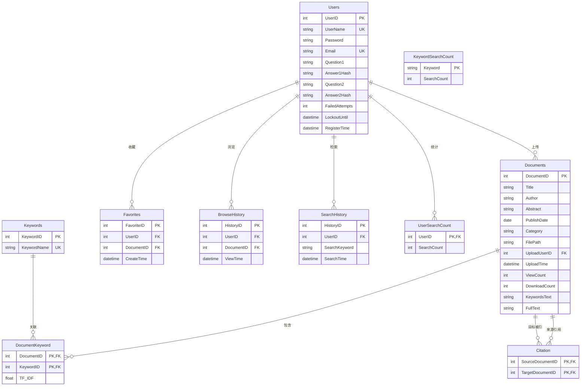

# 学术文献检索系统 —— 数据库设计文档

**数据库管理系统**：Microsoft SQL Server  
**数据库名称**：`AcademicSearchDB`  
**字符集**：支持 Unicode（`NVARCHAR` 系列类型）  
**设计原则**：遵循第三范式（3NF），确保数据冗余最小化，通过外键维护引用完整性。


## 1. 实体关系图（E-R 图）

以下是数据库核心表的实体关系映射（使用 Mermaid 语法），展示了表之间的主键、外键关联。




## 2. 表结构详细说明

### 2.1 用户表（`Users`）
**业务作用**：存储系统注册用户的基本信息、登录凭证（哈希密码）、密码找回安全问题及账户安全状态（锁定/失败次数）。

| 字段名 | 数据类型 | 约束 | 默认值 | 描述 |
| :--- | :--- | :--- | :--- | :--- |
| `UserID` | `INT` | **PRIMARY KEY**, IDENTITY(1,1) | - | 用户唯一标识（自增） |
| `UserName` | `NVARCHAR(20)` | **NOT NULL**, **UNIQUE** | - | 登录用户名（2-20字符） |
| `Password` | `NVARCHAR(255)` | **NOT NULL** | - | 经过 Werkzeug 哈希加密的密码 |
| `Email` | `NVARCHAR(100)` | **NOT NULL**, **UNIQUE** | - | 绑定邮箱 |
| `Question1` | `NVARCHAR(100)` | **NOT NULL** | - | 安全问题1 |
| `Answer1Hash` | `NVARCHAR(255)` | **NOT NULL** | - | 问题1答案的哈希值（不可逆） |
| `Question2` | `NVARCHAR(100)` | **NOT NULL** | - | 安全问题2 |
| `Answer2Hash` | `NVARCHAR(255)` | **NOT NULL** | - | 问题2答案的哈希值（不可逆） |
| `FailedAttempts` | `INT` | - | `0` | 连续登录/找回密码失败次数 |
| `LockoutUntil` | `DATETIME` | - | `NULL` | 账户锁定到期时间（NULL表示未锁定） |
| `RegisterTime` | `DATETIME` | - | `GETDATE()` | 注册时间戳 |

**约束定义**：
- **主键**：`UserID`
- **唯一键**：`UserName`（防止重名），`Email`（防止邮箱重复绑定）


### 2.2 文献表（`Documents`）
**业务作用**：存储上传的学术文献元数据、PDF 存储路径以及从 PDF 中提取的全文内容。

| 字段名 | 数据类型 | 约束 | 默认值 | 描述 |
| :--- | :--- | :--- | :--- | :--- |
| `DocumentID` | `INT` | **PRIMARY KEY**, IDENTITY(1,1) | - | 文献唯一标识（自增） |
| `Title` | `NVARCHAR(500)` | **NOT NULL** | - | 文献标题 |
| `Author` | `NVARCHAR(200)` | **NOT NULL** | - | 作者 |
| `Abstract` | `NVARCHAR(MAX)` | **NOT NULL** | - | 摘要（支持超长文本） |
| `PublishDate` | `DATE` | **NOT NULL** | - | 发表日期 |
| `Category` | `NVARCHAR(100)` | **NOT NULL** | - | 学科分类（如“人工智能”） |
| `FilePath` | `NVARCHAR(500)` | **NOT NULL** | - | PDF 文件在服务器上的相对路径 |
| `UploadUserID` | `INT` | **NOT NULL**, **FOREIGN KEY** | - | 上传者的用户ID |
| `UploadTime` | `DATETIME` | - | `GETDATE()` | 上传时间戳 |
| `ViewCount` | `INT` | - | `0` | 浏览次数（冗余计数，提高查询效率） |
| `DownloadCount` | `INT` | - | `0` | 下载次数（冗余计数） |
| `KeywordsText` | `NVARCHAR(500)` | - | - | 关键词文本（分号分隔，用于列表展示） |
| `FullText` | `NVARCHAR(MAX)` | - | - | 从 PDF 提取的全文内容（用于全文检索） |

**约束定义**：
- **主键**：`DocumentID`
- **外键**：`UploadUserID` 引用 `Users(UserID)`（保证上传用户存在）


### 2.3 关键词表（`Keywords`）
**业务作用**：独立存储系统中所有出现过的关键词，实现字典化统一管理。

| 字段名 | 数据类型 | 约束 | 默认值 | 描述 |
| :--- | :--- | :--- | :--- | :--- |
| `KeywordID` | `INT` | **PRIMARY KEY**, IDENTITY(1,1) | - | 关键词唯一标识（自增） |
| `KeywordName` | `NVARCHAR(100)` | **NOT NULL**, **UNIQUE** | - | 关键词名称（去重存储） |

**约束定义**：
- **主键**：`KeywordID`
- **唯一键**：`KeywordName`（防止相同关键词重复插入）


### 2.4 文献-关键词关联表（`DocumentKeyword`）
**业务作用**：建立文献与关键词之间的多对多关系，并预留 TF-IDF 权重字段用于后续智能检索排序。

| 字段名 | 数据类型 | 约束 | 默认值 | 描述 |
| :--- | :--- | :--- | :--- | :--- |
| `DocumentID` | `INT` | **PRIMARY KEY**, **FOREIGN KEY** | - | 文献ID |
| `KeywordID` | `INT` | **PRIMARY KEY**, **FOREIGN KEY** | - | 关键词ID |
| `TF_IDF` | `FLOAT` | - | `1.0` | 词频-逆文档频率权重（预留） |

**约束定义**：
- **主键**：`(DocumentID, KeywordID)` 复合主键（保证同一文献不重复关联同一关键词）
- **外键1**：`DocumentID` 引用 `Documents(DocumentID)`（级联删除由应用层控制）
- **外键2**：`KeywordID` 引用 `Keywords(KeywordID)`


### 2.5 引用关系表（`Citation`）
**业务作用**：记录文献之间的引用网络，`SourceDocumentID` 引用 `TargetDocumentID`（即 A 引用了 B）。

| 字段名 | 数据类型 | 约束 | 默认值 | 描述 |
| :--- | :--- | :--- | :--- | :--- |
| `SourceDocumentID` | `INT` | **PRIMARY KEY**, **FOREIGN KEY** | - | 引用来源文献（主动引用方） |
| `TargetDocumentID` | `INT` | **PRIMARY KEY**, **FOREIGN KEY** | - | 被引目标文献（被动被引方） |

**约束定义**：
- **主键**：`(SourceDocumentID, TargetDocumentID)` 复合主键（防止重复建立相同的引用关系）
- **外键1**：`SourceDocumentID` 引用 `Documents(DocumentID)`
- **外键2**：`TargetDocumentID` 引用 `Documents(DocumentID)`


### 2.6 收藏表（`Favorites`）
**业务作用**：记录用户对特定文献的收藏行为。

| 字段名 | 数据类型 | 约束 | 默认值 | 描述 |
| :--- | :--- | :--- | :--- | :--- |
| `FavoriteID` | `INT` | **PRIMARY KEY**, IDENTITY(1,1) | - | 收藏记录唯一标识（自增） |
| `UserID` | `INT` | **NOT NULL**, **FOREIGN KEY** | - | 用户ID |
| `DocumentID` | `INT` | **NOT NULL**, **FOREIGN KEY** | - | 文献ID |
| `CreateTime` | `DATETIME` | - | `GETDATE()` | 收藏时间 |

**约束定义**：
- **主键**：`FavoriteID`
- **唯一键**：`(UserID, DocumentID)` 复合唯一约束（同一用户不能重复收藏同一文献）
- **外键1**：`UserID` 引用 `Users(UserID)`
- **外键2**：`DocumentID` 引用 `Documents(DocumentID)`


### 2.7 浏览历史表（`BrowseHistory`）
**业务作用**：记录用户点击查看文献详情的足迹。

| 字段名 | 数据类型 | 约束 | 默认值 | 描述 |
| :--- | :--- | :--- | :--- | :--- |
| `HistoryID` | `INT` | **PRIMARY KEY**, IDENTITY(1,1) | - | 浏览记录唯一标识（自增） |
| `UserID` | `INT` | **NOT NULL**, **FOREIGN KEY** | - | 用户ID |
| `DocumentID` | `INT` | **NOT NULL**, **FOREIGN KEY** | - | 文献ID |
| `ViewTime` | `DATETIME` | - | `GETDATE()` | 浏览时间 |

**约束定义**：
- **主键**：`HistoryID`
- **外键1**：`UserID` 引用 `Users(UserID)`
- **外键2**：`DocumentID` 引用 `Documents(DocumentID)`


### 2.8 检索历史表（`SearchHistory`）
**业务作用**：记录用户每一次执行检索操作的关键词和时间（用于“我的历史”展示）。

| 字段名 | 数据类型 | 约束 | 默认值 | 描述 |
| :--- | :--- | :--- | :--- | :--- |
| `HistoryID` | `INT` | **PRIMARY KEY**, IDENTITY(1,1) | - | 检索记录唯一标识（自增） |
| `UserID` | `INT` | **NOT NULL**, **FOREIGN KEY** | - | 用户ID |
| `SearchKeyword` | `NVARCHAR(200)` | **NOT NULL** | - | 检索关键词 |
| `SearchTime` | `DATETIME` | - | `GETDATE()` | 检索时间 |

**约束定义**：
- **主键**：`HistoryID`
- **外键**：`UserID` 引用 `Users(UserID)`


### 2.9 用户检索计数表（`UserSearchCount`）
**业务作用**：聚合统计每个用户的累积检索次数，用于“活跃用户排行”（数据统计模块）。

| 字段名 | 数据类型 | 约束 | 默认值 | 描述 |
| :--- | :--- | :--- | :--- | :--- |
| `UserID` | `INT` | **PRIMARY KEY**, **FOREIGN KEY** | - | 用户ID |
| `SearchCount` | `INT` | - | `1` | 累积检索次数（每次递增1） |

**约束定义**：
- **主键**：`UserID`
- **外键**：`UserID` 引用 `Users(UserID)`


### 2.10 关键词检索计数表（`KeywordSearchCount`）
**业务作用**：聚合统计每个关键词被用户检索的总次数，用于“热门关键词排行”（数据统计模块）。

| 字段名 | 数据类型 | 约束 | 默认值 | 描述 |
| :--- | :--- | :--- | :--- | :--- |
| `Keyword` | `NVARCHAR(200)` | **PRIMARY KEY** | - | 关键词（作为主键） |
| `SearchCount` | `INT` | - | `1` | 累积检索次数（每次递增1） |

**约束定义**：
- **主键**：`Keyword`


## 3. 约束关系汇总表

| 约束类型 | 涉及表 | 字段 | 具体作用 |
| :--- | :--- | :--- | :--- |
| **主键** | 全部 10 张表 | 各自 ID 或复合字段 | 保证每条记录的唯一性 |
| **外键** | `Documents` | `UploadUserID` → `Users.UserID` | 防止上传者被删除后出现孤儿文献 |
| **外键** | `DocumentKeyword` | `DocumentID` → `Documents`<br>`KeywordID` → `Keywords` | 确保关联的文献和关键词真实存在 |
| **外键** | `Citation` | `SourceDocumentID` → `Documents`<br>`TargetDocumentID` → `Documents` | 确保引用的文献双方都存在 |
| **外键** | `Favorites` | `UserID` → `Users`<br>`DocumentID` → `Documents` | 确保收藏基于真实用户和文献 |
| **外键** | `BrowseHistory` | `UserID` → `Users`<br>`DocumentID` → `Documents` | 确保浏览记录关联真实数据 |
| **外键** | `SearchHistory` | `UserID` → `Users` | 确保检索历史关联真实用户 |
| **外键** | `UserSearchCount` | `UserID` → `Users` | 确保统计关联真实用户 |
| **唯一键** | `Users` | `UserName`, `Email` | 防止用户名/邮箱重复注册 |
| **唯一键** | `Keywords` | `KeywordName` | 防止关键词重复入库 |
| **唯一键** | `Favorites` | (`UserID`, `DocumentID`) | 防止同一用户重复收藏同一文献 |
| **唯一键** | `Citation` | (`SourceDocumentID`, `TargetDocumentID`) | 防止重复建立相同的引用关系 |
| **默认值** | 全部表 | `GETDATE()` 用于时间戳字段 | 自动记录操作时间 |


## 4. 索引建议（扩展）

为提升检索性能，建议在生产环境创建以下非聚集索引（当前代码未强制要求，但强烈建议）：

```sql
-- 提升标题/作者/分类检索速度
CREATE INDEX IX_Documents_Title ON Documents(Title);
CREATE INDEX IX_Documents_Author ON Documents(Author);
CREATE INDEX IX_Documents_Category ON Documents(Category);
CREATE INDEX IX_Documents_PublishDate ON Documents(PublishDate);

-- 提升全文检索速度（需启用 SQL Server 全文索引）
-- CREATE FULLTEXT CATALOG ftCatalog AS DEFAULT;
-- CREATE FULLTEXT INDEX ON Documents(FullText) KEY INDEX PK_Documents;

-- 提升外键关联查询效率
CREATE INDEX IX_Documents_UploadUserID ON Documents(UploadUserID);
CREATE INDEX IX_Favorites_UserID ON Favorites(UserID);
CREATE INDEX IX_BrowseHistory_UserID ON BrowseHistory(UserID);
```

---

> **文档说明**：本设计完全基于项目源代码（`routes/`、`utils.py` 等模块）中所有 SQL 语句逆向推导生成，严格匹配业务逻辑层的数据操作需求，无冗余字段，无缺失约束。